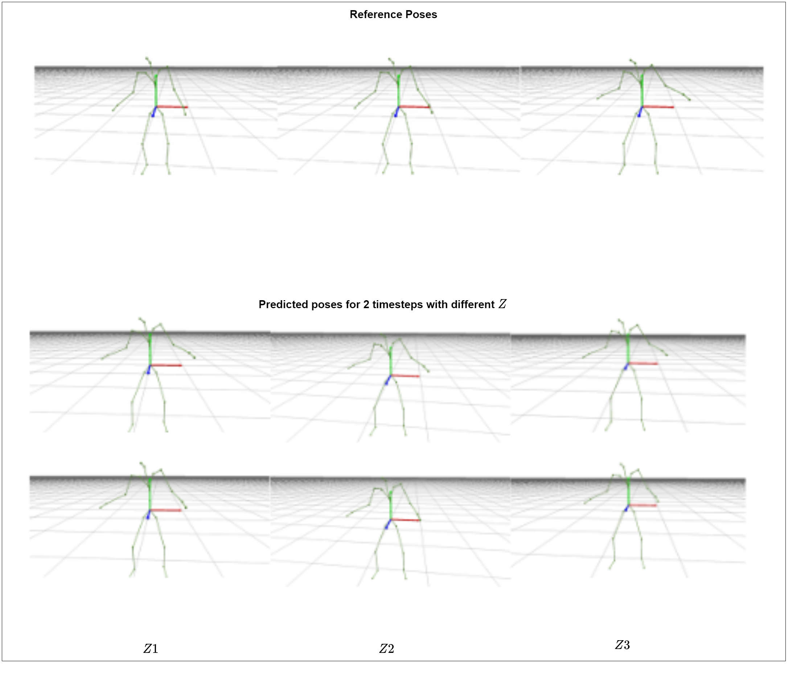

# fairmotion

fairmotion provides easy-to-use interfaces and tools to work with motion capture data. The objective of the library is to manage the complexity of motion representation, 3D transformations, file formats and visualization, and let users focus on high level learning tasks.

Users can take advantage of large high-quality motion capture datasets like the [CMU](http://mocap.cs.cmu.edu/) and [AMASS](https://amass.is.tue.mpg.de/) datasets without deep knowledge of the domain or handling the idiosyncrasies of individual datasets. We implement baselines for research tasks using building blocks from the library to demonstrate its utility.


## Getting Started

### Installation

farmotion is available on PyPI for easy installation

```
pip install fairmotion
```

To install fairmotion from source, first clone the git repository, use pip to download dependencies and build the project.

```
$ git clone https://github.com/facebookresearch/fairmotion.git
$ cd fairmotion
$ pip install -e .
```

### Data Loading

Here, we load a motion capture file in the BVH file format in a python console. Similarly, there are loaders to import files from [ASF/AMC](https://research.cs.wisc.edu/graphics/Courses/cs-838-1999/Jeff/ASF-AMC.html), [AMASS](https://amass.is.tue.mpg.de/dataset) and [AMASS DIP](http://dip.is.tuebingen.mpg.de/pre_download) formats.

```
from fairmotion.data import bvh

BVH_FILENAME = “PATH_TO_BVH_FILE”
motion = bvh.load(BVH_FILENAME)
```

If you recieve errors like the ones below, you can find the workaround [here](https://stackoverflow.com/questions/65202395/pyopengl-on-macos-bigsur-and-opengl-error-nullfunctionerror#:~:text=if%20name%20%3D%3D%20%27OpenGL%27%3A%0A%20%20%20%20fullName%20%3D%20%27/System/Library/Frameworks/OpenGL.framework/OpenGL%27%0Aelif%20name%20%3D%3D%20%27GLUT%27%3A%0A%20%20%20%20fullName%20%3D%20%27/System/Library/Frameworks/GLUT.framework/GLUT%27).

```
ImportError: ('Unable to load OpenGL library', 'dlopen(OpenGL, 10): image not found', 'OpenGL', None)
or
OpenGL.error.NullFunctionError: Attempt to call an undefined function glutInit, check for bool(glutInit) before calling
```
# Convolutional Sequence-to-Sequence Model for Human-Motion Prediction
```
python fairmotion/tasks/motion_prediction/training.py     --save-model-path <SAVE_MODEL_PATH>     --preprocessed-path <PATH_TO_DATA>    --architecture conv_seq2seq
```

# Temporal Convolutional Networks (TCN) for Human Motion Prediction


Our work proposes the use of _1D Dilated-Causal_ convolutions for motion prediction. Our implementation uses `torch == 1.8.1+cu111` and we contribute two architectures,

- Temporal Convolutional Networks ( [TCN](./models/) )
- Generative Adversarial Networks with TCN ( [TCN-GAN](./models/) )

## Installation and Setup

Install the fairmotion library from PyPI and setup the local system by installing the necessary libraries from `pip` or `conda`.

`pip install fairmotion`

To build it from source, clone this repository and build the project.

`$ git clone https://github.com/facebookresearch/fairmotion.git` <br>
`$ cd fairmotion` <br>
`$ pip install -e .`

For real time logging of the metrics including training losses of generator and discriminator, validation losses and Mean Angle Errors (MAE), you can set the `--wandb` flag to 1. To install `wandb`, run `pip install wandb` command and update your project name and session info in the [training script](./tasks/motion_prediction/training.py)

## Dataset

In our study, we used the [AMASS ACCAD](https://amass.is.tue.mpg.de/) dataset. Follow this link to download the dataset from our [drive](https://gtvault-my.sharepoint.com/:u:/g/personal/skumar671_gatech_edu/EQa0xTdWhRJIpcRrtqf_BXwBZ7eLeomV5zX1uXBxdDLi4Q?e=r5Yfj2) and the [Motion Prediction section](./tasks/motion_prediction) for dataset placement and directory structure.

## Usage

### 1. TCN

Our proposed TCN is inspired from [this work](https://www.sciencedirect.com/science/article/abs/pii/S0020025520308896) and hence follows a similar architecture with slight modifications in the network layers. For the motion prediction task, we feed an input sequence consisting of `120` time frames and predict `24` time frames in the future. The proposed architecture is shown below,


Once the setup is complete execute this command to run TCN.

`python fairmotion/tasks/motion_prediction/training.py
    --save-model-path <PATH TO SAVE MODELS>
    --preprocessed-path <PREPROCESSED DATA PATH>
    --architecture tcn --attention 0 --epochs 100`

<br>

### 2. TCN-GAN

We also studied the performance of Generative Adversarial Networks to generate a set of distinct and kinematically valid future poses given an input pose conditioned on a latent embedding $Z ∼ N (0, 1)$. Since the TCN outperforms all the other networks that we researched, it forms the generator of the GAN. The discriminator follows a similar structure [this work](https://www.sciencedirect.com/science/article/abs/pii/S0020025520308896) except for the final output layer where we use a _ReLU_ activation instead of _Sigmoid_. We study the performance of TCN-GAN with only the _Consistency Discriminator_ and we have not used the _Fidelity Discriminator_ in tandem. We modified the architectures and loss functions in order to improve the performance and stabilize the training of our GAN with only one discriminator. The architecture is shown below,


Once the setup is complete execute this command to run TCN-GAN.

`python fairmotion/tasks/motion_prediction/training.py
    --save-model-path <PATH TO SAVE MODELS>
    --preprocessed-path <PREPROCESSED DATA PATH>
    --architecture tcn_gan --attention 0 --epochs 100
    `

We have added an additional [gradient penalty](https://arxiv.org/abs/1704.00028) loss function for the discriminator to improve the stability of training and to enforce the $\rho$ - Lipschitz constraint. You can use that by setting `--gp-loss` flag to 1 in the above command. In addition to that, to reduce the number of discriminator updates, we have added the `--n-crit-iterations` which is 1 by default.

The **test MAE's** for the TCN-GAN model is tabulated below. We can see 3 possible futures for a single input sequence which is achieved by conditioning it on different latent vectors.

| Frames | Random Seed 1 (MAE) | Random Seed 2 (MAE) | Random Seed 3 (MAE) |
| ------ | ------------------- | ------------------- | ------------------- |
| @6     | 2.158               | 2.157               | 2.174               |
| @12    | 6.240               | 6.266               | 6.233               |
| @18    | 11.927              | 11.930              | 11.900              |
| @24    | 18.155              | 18.130              | 18.162              |

The final predictions for the networks are as follows,

#### 1.TCN


#### 2.TCN-GAN


<br>

The weights of the TCN architecture with and without attention are visualised below. <br>


We can see that the network never peeks into the future
because of _temporal masking_. TCN **with** attention learns information about specific joint angles that affect the future poses and hence the
weights are more concentrated in contrast to TCN **without** attention.

### Data saving

We can save the manipulated motion object back into the bvh file format for us to visualize the result.

```
NEW_BVH_FILENAME = "PATH_TO_NEW_BVH_FILE"
bvh.save(sliced_motion, NEW_BVH_FILENAME)
```

### Visualization

We visualize the results using the `bvh_visualizer` tool.

```
$ python fairmotion/viz/bvh_visualizer.py --bvh-files $NEW_BVH_FILENAME
```

## Tasks

The `tasks` module showcases practical usage of fairmotion modules as building blocks in developing projects.

- [Motion Prediction](https://github.com/facebookresearch/fairmotion/tree/master/fairmotion/tasks/motion_prediction)
- [Motion Graph](https://github.com/facebookresearch/fairmotion/tree/master/fairmotion/tasks/motion_graph)
- [Clustering of motion capture dataset](https://github.com/facebookresearch/fairmotion/tree/master/fairmotion/tasks/clustering)
- [Changepoint Detection](https://github.com/facebookresearch/fairmotion/tree/master/fairmotion/tasks/changepoint_detection)

fairmotion has been used in some form in the following works:

- Jungdam Won, Deepak Gopinath, and Jessica Hodgins. “A Scalable Approach to Control Diverse Behaviors for Physically Simulated Characters” to be presented at SIGGRAPH 2020 [[Project page with code and paper](https://research.fb.com/publications/a-scalable-approach-to-control-diverse-behaviors-for-physically-simulated-characters/)]
- Tanmay Shankar, and Abhinav Gupta. "Learning Robot Skills with Temporal Variational Inference." ICML 2020
- Jungdam Won, and Jehee Lee. "Learning body shape variation in physics-based characters." ACM Transactions on Graphics (TOG) 2019

## Citation

If you find fairmotion useful in your research, please cite our repository using the following BibTeX entry.

```
@Misc{gopinath2020fairmotion,
  author =       {Gopinath, Deepak and Won, Jungdam},
  title =        {fairmotion - Tools to load, process and visualize motion capture data},
  howpublished = {Github},
  year =         {2020},
  url =          {https://github.com/facebookresearch/fairmotion}
}
```

## License

fairmotion is released under the [BSD-3-Clause License](https://github.com/facebookresearch/fairmotion/blob/master/LICENSE).
