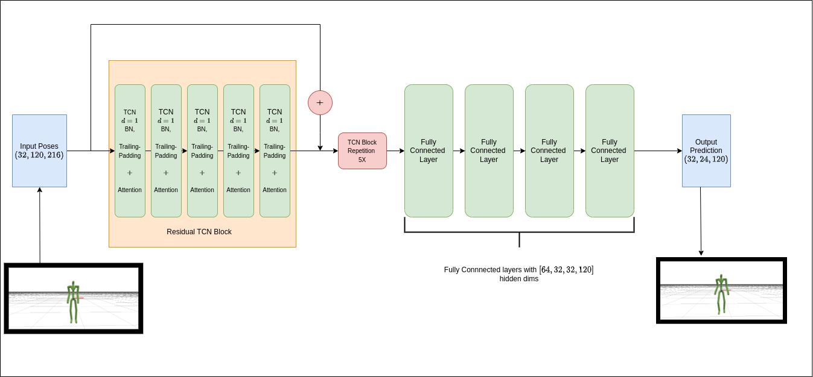
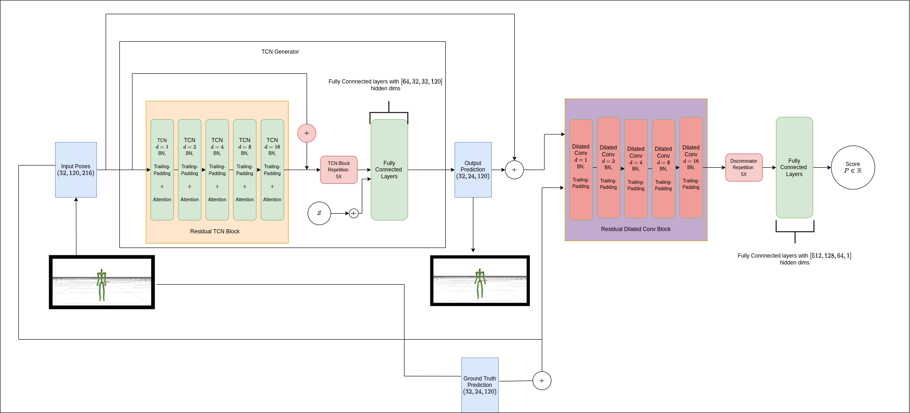
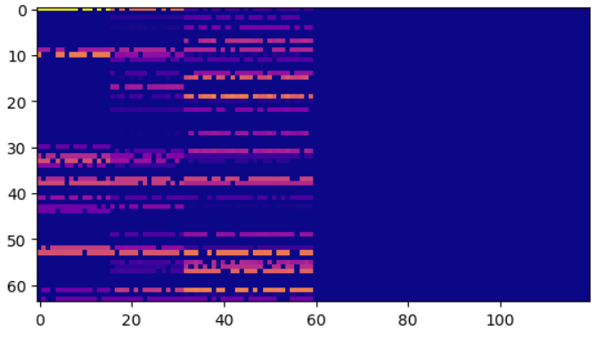

# Temporal Convolutional Networks (TCN) for Human Motion Prediction
Our work proposes the use of *1D Dilated-Causal* convolutions for motion prediction. Our implementation uses `torch == 1.8.1+cu111`. We contribute two architectures,
- Temporal Convolutional Networks ( [TCN](./TCN/) ) 
- Generative Adversarial Networks with TCN ( [TCN-GAN](./TCGAN/) )

## Installation and Setup
Install the fairmotion library from PyPI and setup the local system by installing the necessary libraries from `pip` or `conda`. 

`pip install fairmotion`

To build it from source, clone this repository and build the project.

`$ git clone https://github.com/`  
`$ cd fairmotion`  
`$ pip install -e .`

For real time logging of the metrics including training losses of generator and discriminator, validation losses and Mean Angle Errors (MAE), you can set the `--wandb` flag to 1. To install `wandb`, run 'pip install wandb` command and update your project name and session info in the [training script](./training.py)

## Dataset
In our study, we used the [AMASS ACCAD](https://amass.is.tue.mpg.de/)    dataset. Follow this link to download the dataset from our [drive](https://gtvault-my.sharepoint.com/:u:/g/personal/skumar671_gatech_edu/EQa0xTdWhRJIpcRrtqf_BXwBZ7eLeomV5zX1uXBxdDLi4Q?e=r5Yfj2) and the Motion Prediction section for dataset placement and directory structure.

## Usage
### 1. TCN 

Our proposed TCN is inspired from [this work](https://www.sciencedirect.com/science/article/abs/pii/S0020025520308896) and hence follows a similar architecture with slight modifications in the network layers. For the motion prediction task, we feed an input sequence consisting of `120` time frames and predict `24` time frames in the future. The proposed architecture is shown below, 

Once the setup is complete execute this command to run TCN.

`python fairmotion/tasks/motion_prediction/training.py \
    --save-model-path <PATH TO SAVE MODELS> \
    --preprocessed-path <PREPROCESSED DATA PATH> \
    --architecture tcn
    --attention 0
    --epochs 100`

 

### 2. TCN-GAN
We also studied the performance of Generative Adversarial Networks to generate a set of distinct and kinematically valid future poses given an input pose conditioned on a latent embedding $Z ∼ N (0, 1)$. Since the TCN outperforms all the other networks that we researched, it forms the generator of the GAN. The discriminator follows a similar structure [this work](https://www.sciencedirect.com/science/article/abs/pii/S0020025520308896) except for the final output layer where we use a ReLU activation instead of Sigmoid. We study the performance of TCN-GAN with only the *Consistency Generator* and we have not used the *Fidelity Discriminator* in tandem. We modified the architectures and loss functions in order to improve the performance and stabilize the training of our GAN with only one discriminator. The architecture is shown below,

Once the setup is complete execute this command to run TCN-GAN.

`python fairmotion/tasks/motion_prediction/training.py \
    --save-model-path <PATH TO SAVE MODELS> \
    --preprocessed-path <PREPROCESSED DATA PATH> \
    --architecture tcn_gan
    --attention 0
    --epochs 100
    `

We have added an additional [gradient penalty](https://arxiv.org/abs/1704.00028) loss function for the discriminator to improve the stability of training and to enforce the $\rho$ - Lipschitz constraint. You can use that by setting `--gp-loss` flag to 1 in the above command. In addition to that, to reduce the number of discriminator updates, we have added the `--n-crit-iterations` which is 1 by default. 

The **test MAE's** for the TCN-GAN model is tabulated below. We can see 3 possible futures for a single input sequence which is achieved by conditioning it on different latent vectors.

|Frames | Random Seed 1 (MAE) | Random Seed  2 (MAE)| Random Seed 3 (MAE) |
|--------  | -------- | -------- | -------- |
|@6 | 2.158 | 2.157 | 2.174 |
|@12 | 6.240 | 6.266 | 6.233|
|@18 | 11.927| 11.930 | 11.900 |
|@24 | 18.155 | 18.130 | 18.162 |
|

The final predictions for the networks are as follows:

The weights of the TCN architecture with and without attention are visualised below.  

We can see that the network never peeks into the future
because of *temporal masking*. TCN **with** attention learns information about specific joint angles that affect the future poses and hence the
weights are more concentrated in contrast to TCN **without** attention.

